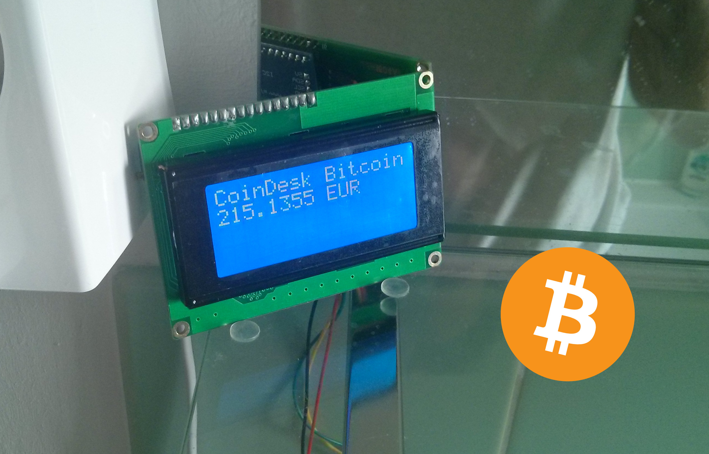

ESP8266 CoinDesk Bitcoin LCD

Build dependencies:

* [ESP8266 Arduino](https://github.com/esp8266/Arduino),
* [ArduinoJson](https://github.com/bblanchon/ArduinoJson) library.

Picture:



I2C LCD pinout customization:

You can also add the following line to your setup function:

```c++
Wire.begin(0, 2);
```

where ```0``` is for the ```SDA``` and ```2``` is for ```SCLK```. Note that this setup is for
an ESP-01 device. By default, the pins are ```4``` (```SDA```) and ```5``` (```SCLK```).
